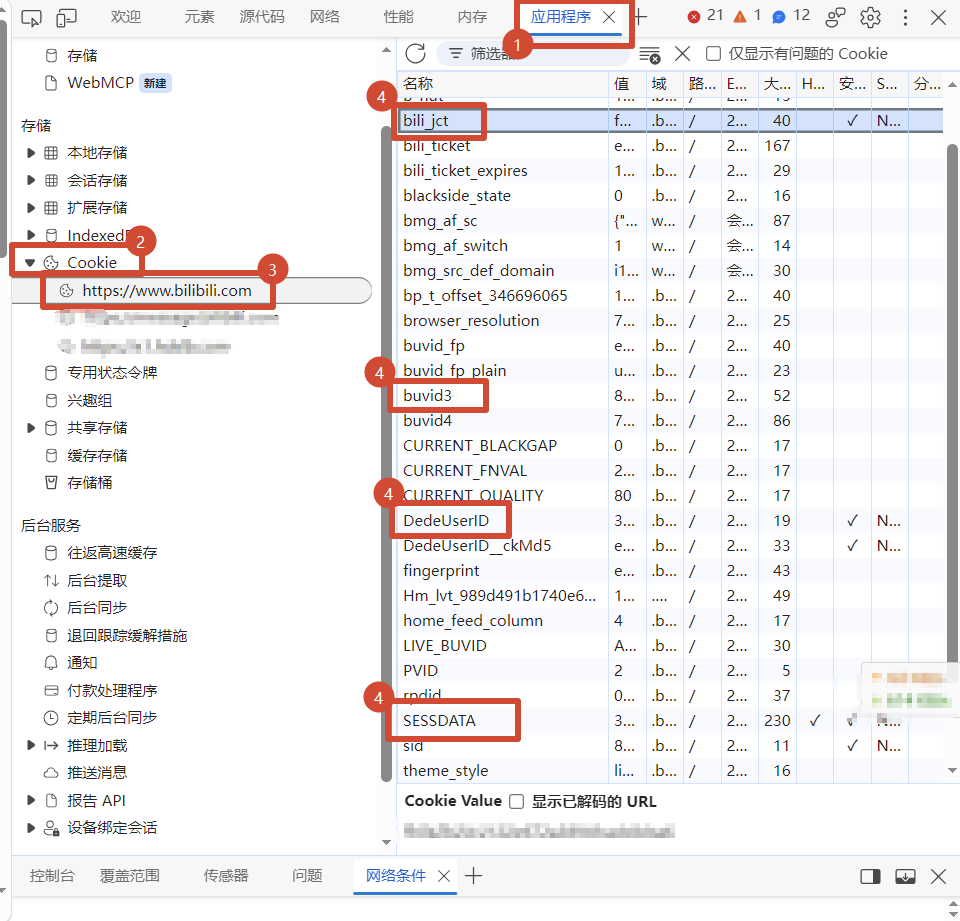
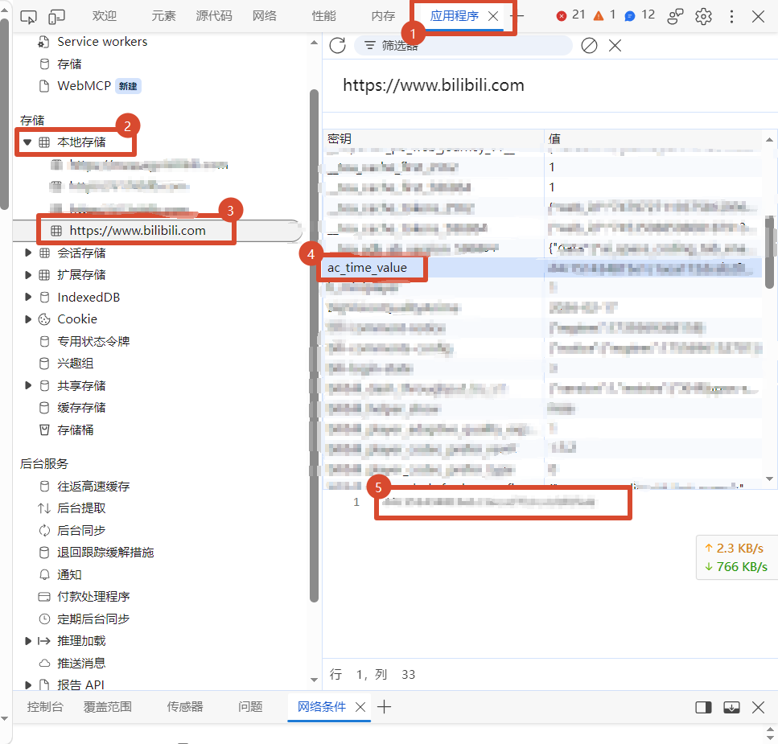

# B站评论自动回复机器人

基于 `bilibili-api` + 通义千问（DashScope）的多视频评论监控与自动回复工具。支持固定模板回复、多种 AI 风格回复，以及按 UP 主 UID 自动发现新投稿。

## 功能概览

- 监控一个或多个视频的新评论并自动回复
- AI 多风格回复（自然 / 幽默 / 毒舌 / 温暖 / 专业等，可自定义）
- 配置 UP 主 UID 后自动发现新视频并加入监控
- SQLite 记录已回复评论，避免重复回复
- 配置热加载：运行中修改 `config.yaml` 会自动重载
- 日志输出到控制台与 `logs/` 目录
- **Web 控制台**：浏览器查看运行状态、实时日志、管理监控视频与配置（默认 `http://127.0.0.1:8787/`）

## 环境要求

- Python **3.10+**（推荐 3.11 / 3.12）
- 可访问外网（B站 API + DashScope）
- 已登录的 B站账号 Cookie（需具备发评论权限）
- 通义千问 / DashScope API Key（仅在使用 AI 回复时需要）

## 快速开始

### 1. 进入项目目录

```bash
cd bilibili_reply_comment
```

### 2. 创建并填写配置

```bash
cp config.example.yaml config.yaml
```

编辑 `config.yaml`，至少填写：

1. **B站凭证**（`bilibili.credential`）— 获取步骤见 [如何获取 B站 Cookie](#如何获取-b站-cookie)
2. **千问 API Key**（`qwen.api_key`，若使用 AI 回复）
3. **`app.uploader_uid`** 和/或 **`videos`** 列表（至少配置一种监控来源）

完整字段说明见 [配置说明](#配置说明)，也可直接对照 `config.example.yaml`。

### 3. 安装依赖并启动

启动脚本会自动创建虚拟环境、`data/`、`logs/`，并安装依赖。

**macOS / Linux：**

```bash
chmod +x start.sh
./start.sh
```

**Windows：**

双击 `start.bat`，或在命令行执行：

```bat
start.bat
```

**手动启动：**

```bash
python3 -m venv .venv
source .venv/bin/activate          # Windows: .venv\Scripts\activate
pip install -r requirements.txt
mkdir -p logs data
python bilibili_auto_reply.py
```

停止程序：按 `Ctrl+C`。

启动后打开浏览器访问 **http://127.0.0.1:8787/** 即可使用控制台（无需一直盯着命令行窗口；可将窗口最小化）。关闭命令行窗口会结束进程，请用 `Ctrl+C` 正常退出，或使用下方后台启动方式。

**Windows 后台启动（最小化窗口）：** 双击 `start_bg.bat`。

### Web 控制台能做什么

| 功能 | 说明 |
|------|------|
| 概览 | 监控视频数、累计回复、活跃任务、当前参数 |
| 实时日志 | WebSocket 推送，关闭命令行也能看 |
| 监控视频 | 添加 BV、启用/停用、改间隔、删除 |
| 最近回复 | 查看近期自动回复记录 |
| 配置 | 改间隔 / UID / AI / Cookie（敏感项掩码展示） |

相关配置项（`config.yaml` → `app`）：

```yaml
web_enabled: true
web_host: 127.0.0.1   # 仅本机；服务器/局域网改为 0.0.0.0
web_port: 8787
web_username: admin
web_password: '你的强密码'   # 对外访问必须设置；未设则拒绝 0.0.0.0 监听
```

**访问控制与隐私保护：**

- 本机 `127.0.0.1`：可不设密码（方便本机调试）
- 服务器 `0.0.0.0`：**必须**设置 `web_password`，否则控制台不会启动
- 设密码后需登录；会话为 HttpOnly Cookie（JS 读不到），失败过多会临时锁定
- **Cookie / API Key / 控制台密码永不通过接口回传**（页面只显示「已配置」）
- 实时日志会脱敏常见密钥字段；已关闭公开 API 文档
- 建议再加防火墙或 Nginx 反代 + HTTPS，不要把控制台裸奔到公网

## 如何获取 B站 Cookie

1. 浏览器登录 [https://www.bilibili.com](https://www.bilibili.com)
2. 打开开发者工具（F12）→ **应用程序 / Application / 存储** → **Cookies** → `https://www.bilibili.com`
3. 复制以下字段到 `config.yaml` 的 `bilibili.credential`：

| Cookie 名 | 配置字段 | 是否必需 |
|-----------|----------|----------|
| `SESSDATA` | `sessdata` | 必需 |
| `bili_jct` | `bili_jct` | **必需**（发评论） |
| `buvid3` | `buvid3` | 必需 |
| `DedeUserID` | `dedeuserid` | 必需 |
| `ac_time_value` | `ac_time_value` | 建议填写 |

在 Cookies 列表中可找到 `SESSDATA`、`bili_jct`、`buvid3`、`DedeUserID`：



`ac_time_value` 可能不在同一列表里，请按名称搜索后复制：



> Cookie 会过期。若出现登录失败、412 风控或发评失败，请重新从浏览器复制更新。

## 配置说明

字段以 `config.example.yaml` 为准。常用项如下。

### `bilibili` / `qwen` 凭证

| 配置项 | 含义 |
|--------|------|
| `bilibili.credential.*` | B站 Cookie，见上一节 |
| `qwen.api_key` | 通义千问 / DashScope API Key |
| `qwen.base_url` / `qwen.model` | 接口地址与模型名，一般沿用模板即可 |

也可用环境变量覆盖敏感字段，见 [环境变量](#环境变量可选)。

### `app` 应用配置

| 字段 | 含义 | 建议值 |
|------|------|--------|
| `default_check_interval` | 默认评论检查间隔（秒） | `60` 起，监控视频多时可加大 |
| `log_level` | 日志级别 | `INFO` / `DEBUG` |
| `log_dir` | 日志目录 | `logs` |
| `record_dir` | 数据目录 | `data` |
| `uploader_uid` | UP 主 UID，开启自动发现 | 你的 UID，不需要可留空 |
| `video_discovery_interval` | 发现新视频间隔（秒） | 建议 `3600`（1 小时） |
| `default_ai_style` | 新视频默认 AI 风格 | 如 `natural` |
| `video_after` | 单段：该日期及之后 | 如 `2026-09-10`，可与 `video_before` 组成一段 |
| `video_before` | 单段：该日期及之前 | 如 `2026-01-01` |
| `video_date_ranges` | 多段日期列表 | 见下方示例 |

日期按**北京时间**、含起止当天。支持 `2026-09-10` 或 `2026年9月10日`。落在**任意一段**内即会发现。

```yaml
app:
  # 多段：2025-10-01 至 2026-01-01，以及 2026-09-10 之后
  video_date_ranges:
    - after: 2025-10-01
      before: 2026-01-01
    - after: 2026-09-10
    # - '2024-01-01至2024-03-31'
```

该过滤对 **自动发现** 和 **已经在监控的视频** 都生效：范围外的稿件不会再回复（不会从数据库删掉）。修改日期后热重载或重启即可。

### `videos` 种子列表（可选）

监控视频**默认存放在 SQLite**（`data/bilibili_reply.db` → `monitored_videos` 表），不会写回 `config.yaml`，避免视频变多后配置文件臃肿。

`config.yaml` 里的 `videos` 仅作为**一次性种子**：

1. 在 YAML 中临时写上要监控的视频
2. 启动或热重载后自动导入数据库
3. YAML 中的 `videos` 会被清空为 `[]`

日常增删改建议直接操作数据库，或再次往 `videos` 里写少量种子后重启。

每项常用字段：

```yaml
videos:
  - bvid: BV1xxxxxxxx
    title: 标题（可选）
    template: '@{username} 感谢你的评论！'  # use_ai=false 时使用
    interval: 60
    use_ai: true
    ai_style: natural
```

模板可用占位符：`{username}`、`{message}`。

### `ai_reply_styles` 自定义风格

在配置中增加新的 key，并在视频的 `ai_style` 中引用即可。提示词支持：

- `{video_title}` `{video_url}` `{video_desc}`
- `{comment_username}` `{comment_message}`

## 环境变量（可选）

可用环境变量覆盖敏感配置，避免明文写进文件：

| 环境变量 | 覆盖项 |
|----------|--------|
| `BILIBILI_SESSDATA` | `bilibili.credential.sessdata` |
| `BILIBILI_BILI_JCT` | `bilibili.credential.bili_jct` |
| `BILIBILI_BUVID3` | `bilibili.credential.buvid3` |
| `BILIBILI_DEDEUSERID` | `bilibili.credential.dedeuserid` |
| `QWEN_API_KEY` | `qwen.api_key` |

示例：

```bash
export BILIBILI_SESSDATA='你的SESSDATA'
export BILIBILI_BILI_JCT='你的bili_jct'
export QWEN_API_KEY='sk-xxx'
./start.sh
```

## 工作流程简述

1. 启动后将 `videos` 种子导入数据库，并为库中每个视频创建监控任务
2. 按 `interval` 拉取新评论；未在数据库中出现过的评论视为新评论
3. 根据 `use_ai` 生成回复并发送；成功后写入 SQLite
4. 若配置了 `uploader_uid`，会周期性拉取最新投稿，新视频写入数据库并开始监控

## 注意事项与风控

- **不要提交 `config.yaml`**：已在 `.gitignore` 中忽略；仓库只保留 `config.example.yaml`
- API Key、Cookie 属于机密，勿分享、勿截图外传
- 检查间隔过短、同时监控视频过多，容易触发 B站 **412** 风控，请适当加大间隔
- 回复之间默认有约 2 秒间隔，请勿自行改得过激进
- 仅用于**自己账号**视频下的互动；请遵守 B站社区规范与平台服务条款

## 常见问题

**Q: 启动提示缺少配置文件？**  
A: 执行 `cp config.example.yaml config.yaml` 并填写凭证。

**Q: 提示缺少 `bili_jct`？**  
A: 发评论必须有 CSRF token。从 Cookie 复制 `bili_jct` 填入配置。

**Q: AI 回复失败，退回“感谢评论”？**  
A: 检查 `qwen.api_key`、`base_url`、`model` 是否正确，以及网络是否可达 DashScope。

**Q: 自动发现不到新视频 / 412？**  
A: 加大 `video_discovery_interval`，更新 Cookie，稍后再试。

**Q: 想清空已回复记录重新回复？**  
A: 停止程序后删除或备份 `data/bilibili_reply.db`（会丢失去重记录，可能导致重复回复）。

## 目录结构

```text
bilibili_reply_comment/
├── bilibili_auto_reply.py   # 程序入口
├── config.example.yaml      # 配置模板（可提交到 Git）
├── config.yaml              # 实际配置（含密钥，已被 gitignore）
├── requirements.txt         # Python 依赖
├── start.sh                 # macOS / Linux 启动脚本
├── start.bat                # Windows 启动脚本
├── start_bg.bat             # Windows 最小化后台启动
├── app/                     # 业务包
│   ├── main.py              # 服务编排与生命周期
│   ├── config.py            # 配置加载 / 校验 / 热更新
│   ├── api_clients.py       # B站凭证与千问客户端
│   ├── video_monitor.py     # 评论拉取、回复、视频发现
│   ├── database.py          # SQLite 持久化
│   ├── logger.py            # 日志
│   ├── log_buffer.py        # 内存日志缓冲（供 Web 实时推送）
│   └── web/                 # Web 控制台（FastAPI + 静态页）
├── docs/images/             # README 配图
├── data/                    # 运行数据（自动创建）
│   └── bilibili_reply.db    # 回复记录、已发现视频、监控视频列表
└── logs/                    # 日志目录（自动创建）
    └── bilibili_reply_comment.log
```

`data/`、`logs/` 和虚拟环境由启动脚本自动创建；数据库文件会在首次运行时生成。

## 许可证与免责

本项目仅供学习与个人运营辅助使用。使用本工具产生的一切后果由使用者自行承担；请勿用于骚扰、刷评或其他违规用途。
